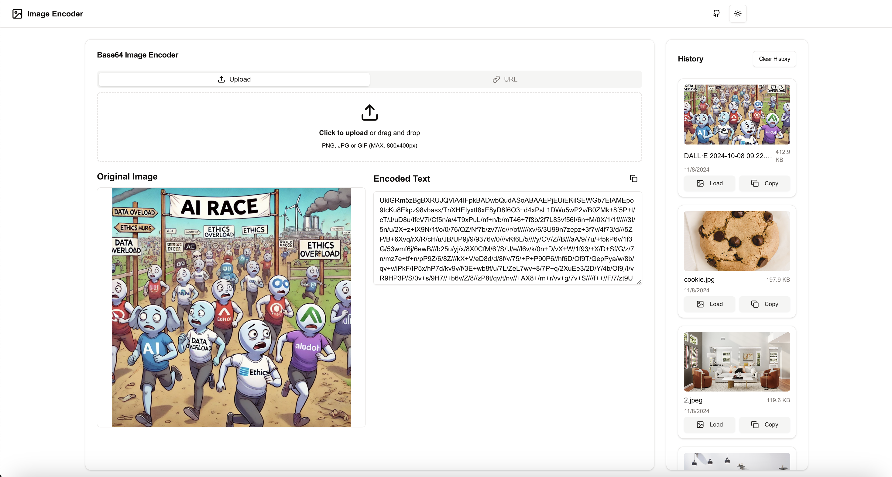

# Image to Base64 Encoder

  

A modern web application that converts images to base64 encoded strings and vice versa. Built with React, TypeScript, and Tailwind CSS.

## 🚀 Features

- Convert images to base64 strings through file upload or URL
- History tracking of recent conversions
- Copy encoded text with one click
- Dark/Light mode support
- Responsive design
- Local storage persistence

## 🎯 Use Cases

### AI Development
- Embed images directly in API requests to AI models
- Test and debug image-related AI features
- Create self-contained datasets with embedded images
- Prototype AI applications without setting up image storage

### Web Development
- Embed small images directly in CSS/HTML
- Create data URIs for efficient asset delivery
- Debug image processing workflows
- Test image upload functionality

### Data Integration
- Transfer images through text-based APIs
- Store images in JSON documents
- Create portable, self-contained data structures
- Implement clipboard image handling

## 💡 Why Base64?

Base64 encoding converts binary image data into ASCII text, making it possible to:
- Include images directly in code or JSON
- Transfer images through text-only channels
- Store images in databases that don't support binary data
- Avoid cross-origin resource sharing (CORS) issues

## 🔧 Technical Details

The encoder:
- Supports PNG, JPG, and GIF formats
- Preserves image metadata
- Implements efficient memory handling
- Provides instant preview

## Usage

Feel free to fork, extend or utilize with credits to the source. 